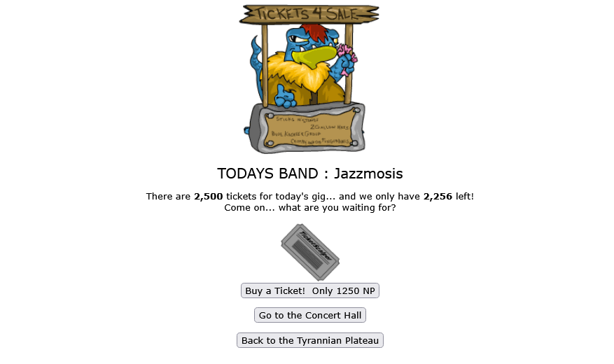
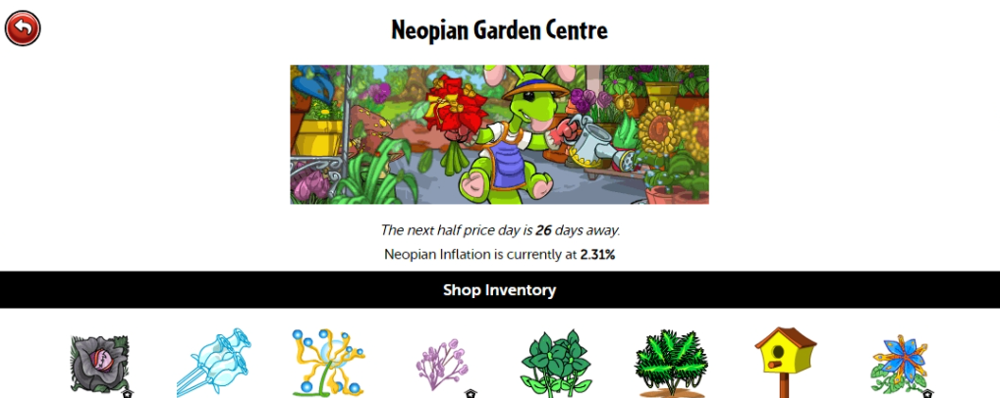

# Neopets-QOL

## [Lazy Concerts](https://github.com/BanksiaFox/Neopets-QOL/blob/main/lazy-concerts.user.js)
Adds a button to the Tyrannian Ticket Booth and Tyrannian Concert Hall pages to travel between them quickly - helps me reduce my *[arthritic](https://github.com/BanksiaFox/NeoHTML/blob/main/eldWock-sad3.png?raw=true)* pain while speedrunning dailies :') 





---

## [Half Price Day Tracker](https://github.com/BanksiaFox/Neopets-QOL/blob/main/HPD-tracker.user.js)
Displays a message at the top of Neopian shops when it is currently half price day, for anyone who repeatedly forgets to take advantage of it. 
When it's **not** half price day, it will display a reminder for how many days until the next. 
When it **is** half price day, a random image will display at the top of the page to grab your attention.




---
 ```
                                        )/_ 
        [more to come, eventually...]  (' \
                                       /)  )
--------------------------------------/'-""-----
```